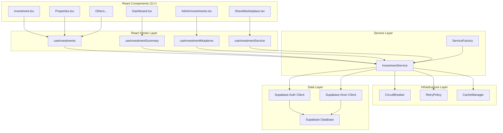

# InvestmentService Architecture

## Overview

Enterprise-grade InvestmentService architecture designed to handle JWT 406 errors with a hybrid approach using anonymous clients for reads and authenticated clients for writes. Built with production-ready patterns including circuit breaker, retry logic, multi-layer caching, and comprehensive monitoring.

## 🏗️ Architecture Diagram



## 🔧 Implementation Strategy

### 1. Hybrid Client Approach
- **Anonymous Client (supabaseInvestments)**: Used for all READ operations to avoid JWT 406 errors
- **Authenticated Client (supabase)**: Used for WRITE operations to maintain security
- Automatic client selection based on operation type

### 2. Circuit Breaker Pattern
- Prevents cascading failures
- Opens after configurable failure threshold
- Automatic recovery testing
- Fallback mechanisms for critical operations

### 3. Multi-Layer Caching
- **Memory Cache**: Fast access with LRU eviction
- **localStorage**: Persistent caching across sessions
- **Tag-based Invalidation**: Efficient cache clearing
- **TTL Management**: Automatic expiration handling

### 4. Retry Logic with Exponential Backoff
- Intelligent retry for transient failures
- JWT 406 error handling
- Jitter to prevent thundering herd
- Configurable retry policies

## 📁 File Structure

```
src/services/
├── types/
│   └── investment.types.ts          # TypeScript interfaces and enums
├── infrastructure/
│   ├── CircuitBreaker.ts            # Circuit breaker implementation
│   ├── RetryPolicy.ts               # Retry logic with backoff
│   └── CacheManager.ts              # Multi-layer caching system
├── core/
│   └── InvestmentService.ts         # Main service implementation
├── factory/
│   └── InvestmentServiceFactory.ts  # Service factory with configurations
└── README.md                        # This documentation

src/hooks/
└── useInvestmentService.ts          # React hooks for easy integration
```

## 🚀 Usage Examples

### Basic Usage in React Components

```typescript
// Simple investment fetching
function InvestmentList() {
  const { data, loading, error } = useInvestments({
    userId: '123',
    status: ['confirmed'],
    limit: 10
  });

  if (loading) return <Loading />;
  if (error) return <Error message={error.message} />;

  return <List items={data} />;
}

// Investment summary with auto-refresh
function DashboardSummary({ userId }: { userId: string }) {
  const { data: summary } = useInvestmentSummary(userId, {
    refreshInterval: 60000 // Refresh every minute
  });

  return <SummaryCard summary={summary} />;
}

// Creating new investments
function CreateInvestmentForm() {
  const { createInvestment, loading, error } = useInvestmentMutations();

  const handleSubmit = async (formData) => {
    const investment = await createInvestment({
      property_id: formData.propertyId,
      amount: formData.amount,
      shares: formData.shares
    });

    if (investment) {
      // Success handling
    }
  };

  return <Form onSubmit={handleSubmit} loading={loading} error={error} />;
}
```

### Direct Service Usage

```typescript
// Get service instance
const service = InvestmentServiceFactory.getInstance();

// Fetch investments with error handling
const result = await service.getInvestments({
  userId: '123',
  orderBy: 'created_at',
  orderDirection: 'desc'
});

if (result.success) {
  console.log('Investments:', result.data);
} else {
  console.error('Error:', result.error);
}
```

### Environment-Specific Configuration

```typescript
// Production service (default)
const prodService = InvestmentServiceFactory.createProductionService();

// Development with more logging
const devService = InvestmentServiceFactory.createDevelopmentService();

// High-performance with aggressive caching
const perfService = InvestmentServiceFactory.createHighPerformanceService();

// Auto-configure based on environment
const autoService = InvestmentServiceFactory.createFromEnvironment();
```

## 🔍 Monitoring and Metrics

### Service Health Monitoring

```typescript
function ServiceHealthDashboard() {
  const { metrics, health } = useInvestmentServiceMetrics();

  return (
    <div>
      <HealthIndicator status={health.healthy} />
      <MetricsDisplay
        successRate={metrics.service.successfulRequests / metrics.service.totalRequests * 100}
        cacheHitRate={metrics.cache.hitRate}
        circuitBreakerState={health.circuitBreakerState}
      />
    </div>
  );
}
```

### Available Metrics
- **Service Metrics**: Total requests, success/failure rates
- **Circuit Breaker**: State, failure counts, recovery times
- **Cache Metrics**: Hit/miss rates, eviction counts
- **Retry Metrics**: Attempt counts, success rates

## ⚙️ Configuration

### Default Production Configuration

```typescript
{
  cache: {
    ttl: 5 * 60 * 1000,        // 5 minutes
    maxMemoryItems: 1000,      // 1000 items in memory
    enablePersistence: true,    // Enable localStorage
    persistenceKey: 'inv_cache:'
  },
  circuitBreaker: {
    failureThreshold: 5,        // Open after 5 failures
    resetTimeout: 30000,        // 30 second reset timeout
    monitoringPeriod: 60000     // 1 minute monitoring window
  },
  retry: {
    maxAttempts: 3,            // 3 retry attempts
    baseDelay: 1000,           // 1 second base delay
    maxDelay: 10000,           // 10 second max delay
    backoffMultiplier: 2       // Exponential backoff
  },
  enableMetrics: true,
  enableLogging: true
}
```

## 🔒 Security Considerations

1. **Client Separation**: Anonymous client for reads prevents JWT exposure
2. **Write Protection**: Authenticated client ensures secure write operations
3. **No Sensitive Data Caching**: User-specific data uses appropriate cache keys
4. **Error Sanitization**: Error details are filtered before logging

## 🚦 Error Handling

### Error Types
- **JWT 406 Errors**: Automatically retried with anonymous client
- **Network Errors**: Handled by retry policy
- **Service Unavailable**: Circuit breaker prevents cascading failures
- **Validation Errors**: Immediate failure with detailed messages

### Fallback Strategies
- Empty arrays for list operations
- Default summary values for dashboard
- Cached data when service is unavailable
- Graceful degradation for non-critical features

## 📈 Performance Optimizations

1. **Lazy Loading**: Components load data only when needed
2. **Request Deduplication**: Identical requests are cached
3. **Memory Management**: LRU eviction prevents memory leaks
4. **Connection Pooling**: Reused Supabase client instances
5. **Compression**: Optional data compression for large datasets

## 🧪 Testing Strategy

```typescript
// Unit tests use test configuration
const testService = InvestmentServiceFactory.createTestService();

// Minimal caching and retries for predictable tests
describe('InvestmentService', () => {
  test('should fetch investments successfully', async () => {
    const result = await testService.getInvestments({ userId: '123' });
    expect(result.success).toBe(true);
  });
});
```

## 🔄 Migration Guide

### From Direct Supabase Usage

```typescript
// Before: Direct Supabase calls
const { data, error } = await supabase
  .from('investments')
  .select('*')
  .eq('user_id', userId);

// After: Service-based approach
const result = await investmentService.getInvestments({ userId });
```

### Component Integration

```typescript
// Before: Manual state management
const [investments, setInvestments] = useState([]);
const [loading, setLoading] = useState(false);

useEffect(() => {
  fetchInvestments();
}, []);

// After: Hook-based approach
const { data: investments, loading } = useInvestments({ userId });
```

## 📋 Deployment Checklist

- [ ] Environment variables configured
- [ ] Service factory environment detection
- [ ] Cache persistence enabled
- [ ] Monitoring dashboards set up
- [ ] Error alerting configured
- [ ] Performance baselines established
- [ ] Circuit breaker thresholds tuned
- [ ] Retry policies optimized

## 🤝 Contributing

1. Follow TypeScript strict mode requirements
2. Add comprehensive error handling
3. Include unit tests for new features
4. Update documentation for API changes
5. Performance test with large datasets
6. Validate security implications

This architecture provides a robust, scalable solution for handling investment data across your React/Supabase application while addressing the specific JWT 406 error challenges you're experiencing.